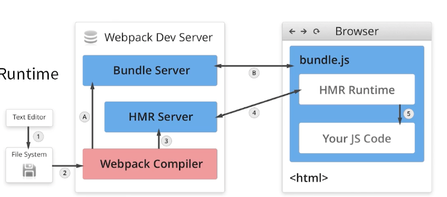

# Webpack 4 Learn
[玩转webpack](https://time.geekbang.org/course/intro/100028901)

### 环境
尽可能的锁版本，避免和教学视频差异过大无法复线
node: v10.21.0
设置淘宝镜像：npm config set registry https://registry.npmmirror.com
查看镜像：npm config get registry

### 打包命令
默认读取根目录下的 webpack.config.js，可以通过 ./node_modules/.bin/webpack 来打包
在webpack3中，modules 还是数组，在webpack4中变成了对象(也有数组)，moduleId由number变成了string [01.bundle.js](./his/01.bundle.js)
package.json 中的scripts 会去读 ./node_modules/.bin 下的命令

### webpack 基础用法
#### entry
一切皆模块，依赖图的入口是entry
#### output
将编译后的文件输出到磁盘
filenam: '[name].js' // 占位符机制

#### loaders
webpack 原生只支持js和json两种文件类型，其他文件类型需要通过loaders去处理为有效的模块（个人理解：即js或json文件）,并且可以添加到依赖图里面
loader 本身是个函数，接受源文件作为参数，返回转换的结果
对同一条规则使用多个loader，是从右到左执行的
##### 常见的 loaders
1. babel-loader 转换新的 js 语法
2. css-loader 支持 .css 文件的加载和解析，并且转换成 commonjs 对象
3. less-loader 将 .less 文件转化为 .css 文件
4. ts-loader 将 ts 文件转化为 js 文件
5. file-loader 对图片、字体等进行处理
6. raw-loader 将文件（如图片、SVG文件）以字符串的形式导入
7. thread-loader 多进程打包 js 和 css (nodejs 默认是单线程的)
#### Plugins
用于增强 webpackd 的能力，用于文件的优化、资源的管理和环境变量的注入，loaders 没法做的事都能通过 Plugins 去做，如构建前删除上次构建目录
作用域整个构建过程，整个构建过程都能使用
##### 常见的 Plugins
1. CommonsChunkPlugin 将chunks相同的模块代码提取成公共 js
2. CleanWebpackPlugin 清理构建目录
3. ExtractTextWebpackPlugin 将 CSS 从 bundle 文件中提取成一个独立的 CSS 文件
4. CopyWebpackPlugin 将文件或文件夹拷贝到构建的输出目录
5. HtmlWebpackPlugin 创建 html 文件去承载输出的 bundle
6. UglifyjsZWebpackPlugin 压缩 JS
7. ZipWebpackPlugin 将打包的资源生成一个 zip 包

### Mode
webpack 4 的新参数，用来指定当前的构建环境（production、development、none）,默认值为 production
通过设置 mode 的值能够通过使用 webpack 的内置函数去触发一些 webpack 的配置
##### development
设置 process.env.NODE_ENV 的值为 development, 开启 NamedChunksPlugin 和 NamedModulesPlugin
##### production
设置 process.env.NODE_ENV 的值为 production, 开启 FlagDependencyUsagePlugin、FlagIncludedChunksPlugin、ModuleConcatenationPlugin、NoEmitOnErrorsPlugin、OccurenceOrderPlugin、SideEffectsFlagPlugin、TerserPlugin 等
##### none
不开启任何优化

#### webpack-dev-server (WDS)
package.json 的 scrpits 增加 "dev": "webpack-dev-server --open", --open 表示自动大考浏览器
用在 devlopment 环境下，
一般配合 webpack 自带的 HotModuleReplacementPlugin（模块热更新）插件使用

##### 原理
初始化是，文件进行编译，将将HRM runtime 编译进bundle中，在bundle server 的作用下，客户端能够通过http的形式访问，当文件变更后，HRM Server 通过 socket 的方式推送给 HRM runtime 进行处理，模块热更新会注入 【module.hot】 但代码逻辑没处理就会一直往上冒泡，直到刷新页面


#### 文件指纹
"[name].[hash:8].[chunkhash:8].[contenthash:8].js"
hash: 和整个项目相关，只要项目文件有修改，整个项目构建的 hash 值就会发生变化，和compilation相关，compilation变化，hash值则变化
chunkhash: 和 webpack 打包的 chunk 有关，不同的 entry 会生成不同的 chunkhash 值
contenthash: 根据文件的内容来定义 hash，文件内容不变则 contenthash 不变，一般对css文件中使用比较多，避免修改 js 导致其引用 css 的打包文件也发生变化

output: 输出js时可以使用chunkhash
css文件: MimiCssExtractPlugin 的 filename 中使用 contenthash
chunkhash: 没法和热更新一起使用

##### 其他的文件指纹
ext: 资源后缀名
name: 文件名称
path: 文件的相对路径
folder: 文件所在文件夹

#### 代码压缩
##### HTML 压缩
插件：html-webpack-plugin
设置压缩参数
##### CSS 压缩
css-loader 1.0 之后去掉了压缩参数
插件: optimize-css-assets-webpack-plugin
同时使用 cssnano 这个预处理器,不用额外下载，在下载上面那个插件中一起下载了
##### JS 压缩
webpack 4 内置了 uglifyjs-webpack-plugin

##### 其他
webpack 5更新下插件替换。
optimize-css-assets-webpack-plugin -> css-minimizer-webpack-plugin
uglifyjs-webpack-plugin->terser-webpack-plugin

#### 打包目录清理
插件：clean-webpack-plugin

#### CSS 兼容性
兼容性查询：[caniuse](https://caniuse.com/)
loader: postcss-loader
autoprefixer

#### rem
w3c 对 rem 的定义：font-sze of the root element
rem 和 px 的对比：rem 是相对单位，px 是绝对单位
px2rem-loader: 将px转化为rem
lib-flexible: 计算根元素上的像素值

#### source map
文章： 
[source map](https://www.ruanyifeng.com/blog/2013/01/javascript_source_map.html)
[你知道source map如何帮你定位源码么？](https://blog.51cto.com/u_15490526/5513873)
[脚本错误量极致优化-让脚本错误一目了然](https://github.com/joeyguo/blog/issues/14)
[利用sourceMap定位错误实践](https://juejin.cn/post/6882265367251517447)

#### 提取页面公共资源

##### 基础库分离
将 react、react-dom 等基础库包通过 CDN 引入，不打入 bundle 中, 基础库可以长期使用，通过 CDN 引入能持续受益
方法: 使用 html-webpack-externals-plugin，这个插件被废弃了
##### 公共脚本分离
webpack 4 内置了 SplitChunksPlugin，代替之前的 CommonsChunkPlugin
chunks 参数说明:
'async' 异步引入库进行分离（默认）
'initial' 同步引入库进行分离
'all': 所有引入库进行分离（推荐）
需要将对应的 chunk 名称放入 HtmlWebpackPlugin 的 chunks 中国

#### Tree-shaking
只能在 ESM（ES6语法） 下使用，不支持在 CJS 下使用
mode: 'development' 下会开启，为 'none' 时不会开启

#### Scope Hoisting
大量函数闭包包裹代码，导致体积增大（模块越多越明显）
运行代码时穿件的函数作用域变多，内存开销变大
引用多次的不会触发socpe hositing
##### 原理
将所有模块的代码按照引用顺序放在一个函数作用域里，然后适当的重命名一些变量以防止变量名冲突
##### 模块转化
被 webpack 转换后的模块会带上一层包裹
import 会被转化为 __webpack_require__

#### 代码分割
1. 抽离相同代码到一个共享块（SplitChunksPlugin）
2. 懒加载，使得初始下载的代码更小，用到了再去加载对应的代码
##### 懒加载方式
CommonJS: requires.ensure
ES6: 动态 import （目前还没有原生支持，需要 babel 转换（@babel/plugin-syntax-dynamic-import））

#### ESlint
用作js代码语法检查
[ESLint](http://eslint.cn/docs/user-guide/getting-started)
[前端代码规范工具ESLint和Prettier](https://blog.csdn.net/yi_zongjishi/article/details/125185269)
##### 使用

```json
{
  "rules": {
    "no-console": "off",
    "indent": ["error", 4],
    "semi": ["error", "always"],
  }
}
```
关闭规则："off" 或 0
开启规则："warn" 或 1，不会导致程序退出
开启规则："error" 或 2，当被触发时，程序会退出
对于常规的直接用数字或字符串，如 "no-console": "off"
对于有额外参数的可以使用数组字面量，如 "indent": ["error", 4]，第一个参数是规则级别，第二个参数是参数

### SSR
```javascript
{
  vendors: {
    test: /(react|react-dom)/,
    // test: /[\\/]node_modules[\\/]/,
    chunks: 'all',
    name: 'vendors', // 可以不传
  }
}
```
上述配置存在否导致了和课程的打包结果不一致，存在的时候，拿到的文件内容为空， commit: 2436cc99de8a

[03.search-server](./his/03.search-server.js)
```javascript
return __webpack_require__(__webpack_require__.s = 0);
```
[04.search-server](./his/04.search-server.js)
```javascript
return checkDeferredModules();
```
问题分析，因为分离包的原因，react & react-dom 是当前包的前置依赖，所以必须等到这个分离包存在才可以保证程序继续执行，猜想解决方式是让分离包不是第一个引用即可(没成功)

react react-dom 版本由 16.8.6 换成 16.14.0
useState 这种hooks没法使用，原因待查

##### 其他
for webpack 5, 需要在webpack配置文件中添加两个配置参数
target: 'node',
externals: nodeExternals(),
否则打出来的文件将无法在node端运行，回报错
（上述待验证）

##### 解决 useState 报错问题
[Invalid hook call. Hooks can only be called inside of the body of a function component](https://github.com/vercel/next.js/issues/7626)
[webpack-node-externals](https://github.com/liady/webpack-node-externals)

再出问题，nodeExternals 导致错误 Uncaught ReferenceError: require is not defined

##### 文章
[webpack的加载](https://segmentfault.com/a/1190000040942526)
[服务端渲染（SSR）](https://v3.umijs.org/zh-CN/docs/ssr)
[React Hooks 在 SSR 模式下常见问题及解决方案](https://zhuanlan.zhihu.com/p/373002592)
[服务端渲染SSR及React实现](https://www.jianshu.com/p/d78cbfd1f49b)

#### 统计信息 stats
errors-only: 只有发生错误时输出
minimal: 只有发生错误或由新的编译时输出
none: 没有输出
normal: 标准输出
verbose: 全部输出(默认值)

插件：friendly-errors-webpack-plugin

#### 获取构建异常
获取错误码：echo $?
0: 成功，回调函数中, err 为 null; 非 0 表示执行失败, 回调函数中 err 不为 null, err.code 就是传给 exit 的数字